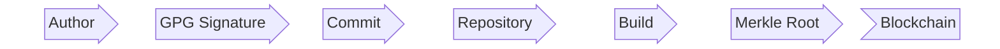
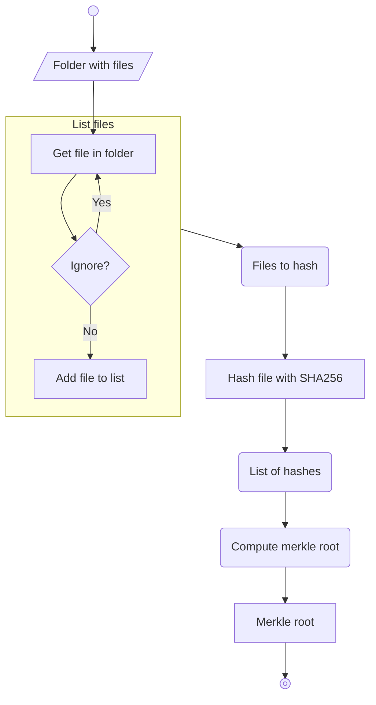

## :dart: Requirements

### :spiral_notepad: Description

I want to write a small program to learn something about blockchain technology. My idea was to save data defining a status of a software deployment in a blockchain. 

> [!NOTE]
> I would not recommend to use this in production but as a learning project it is fine. There are exisiting solutions like [sigstore/rekor: Software Supply Chain Transparency Log](https://github.com/sigstore/rekor) which do similar things. But I want to implement it on my own to learn something about blockchains. 

The data I want to save are:
- Name of the software
- Version number
- Timestamp of deployment
- Commit hash
- Url to repository
- Author like name of company
- Contact information like email
- Merkle root of the deployed files

The name, the version number and the timestamp are metainformation about the deployment. It just improves the readability and helps the user to identify what version he has.
The commit hash and the url to the repository allow to identify the source code of the deployment. By inspecting the commit a signing with GPG might give further trust to the code. For example, it shows that GitHub knows the identity of the author who pushed the code.

> [!IMPORTANT]
> I will develop this project with Git and GitHub in mind. Other version control systems and repository hosting services are out of scope for now but the data model should be designed in a way that it can be extended later.

The author and contact information allow to identify who did the deployment. It is just for transparency. 

The merkle root allows to verify the integrity of the deployed files. It is a hash value calculated from all files of the deployment. By comparing the merkle root stored in the blockchain with a merkle root calculated from the deployed files, it is possible to verify that no file has been changed after the deployment.

This builds a chain of trust from the author who did the deployment to the source code and the deployed files. Transparently stored in a blockchain to prevent manipulation. Users can verify the integrity of the deployed files by themselves.

This builds a chain of trust like this:



The program should allow to add new deployment records to the blockchain and sign them with a key as a developer and to verify existing records by users.

### :question: Open Questions?
1. @Who: What must be discussed?

### :construction: Blockers

1. Something blocks my work.

### :inbox_tray: Input
- Name of the software
- Version number
- Timestamp of deployment
- Commit hash
- Url to repository
- Author like name of company
- Contact information like email

### :outbox_tray: Output

- Merkle root of the deployed files
- A block in the blockchain containing the deployment record.

### :control_knobs: Conditions

None

### :warning: Side effects

Are there any?

## :heavy_check_mark: Acceptance tests

- [ ] I will check that all needed data is stored in the blockchain.
- [ ] I will check the chain of trust by checking the signature of the author in GitHub. Than in the blockchain the project url and commit hash. Finally the merkle root of the deployed files. Lastly I will check the signature of the deployment record with the public key of the developer.

## :triangular_ruler: Design

I will write a cli app in Python because it is also a Python workshop. The app should be able to automate all steps developers or users have to do. Those are adding a new deployment record to a blockchain. The new block should be broadcasted to other nodes in the network. Users should be able to verify existing deployment records by checking the signatures and the merkle root.

The app needs to have functions to create a merkle root from a set of files. A deployment is always a set of files. It might be a set of binaries or an installer or just source code. The deployment must be organized in a folder. This folder is the input for the merkle root calculation. The directory is scanned for files and all files are listed as the method `.rglob("*")` from `pathlib` returns them. `.gitignore` files are honored. The folder `.git` and exactly those files ignored by git are not considered for the merkle root calculation. The files are hashed with SHA256. The hashes are combined pairwise and hashed again until only one hash remains. This is the merkle root.



It needs to have functions to create and verify signatures with asymmetric cryptography. That means developers need to create a key pair. The private key is used to sign deployment records. The public key is used by users to verify the signatures. In a first step I will try to use Solana as blockchain platform. It has cheap and fast transactions, which is good for the task. There are libraries for Python to interact with Solana.

[kevinheavey/solders: A high-performance Python toolkit for Solana, written in Rust](https://github.com/kevinheavey/solders)

[michaelhly/solana-py: Solana Python SDK](https://github.com/michaelhly/solana-py)

I will generate the key pair with an mnemonic seed phrase. The libraries have functions to create key pairs from a seed phrase. This way a user can store the seed phrase on a safe offline medium and recreate the key pair when needed.

Solana uses the Ed25519 algorithm for signing and verifying signatures and uses a Base58 encoding for the public key as the address. The public key is also the address of an account on Solana. This is much simpler than other blockchains do it but state of the art and safe. I will adapt this approach for the custom key pair as well. The public key is the address and the private key is used for signing. The public key is encoded in Base58 to get the address.

I will store the keypair in DPAPI/Windows-Keychain to keep it secure. The user can generate a new key pair with the app and store it in the Windows-Keychain. The user can also select from stored key pairs in the Windows-Keychain and load the selected key pair for signing deployment records. Keys must be stored in user scope. The good news is. There is a lib for that. [jaraco/keyring](https://github.com/jaraco/keyring)

The app prompts the user to enter the data interactively.

The data is:

- Name of the software
- Version number
- Timestamp of deployment
- Commit hash
- Url to repository
- Author like name of company
- Contact information like email
- Merkle root of the deployed files

## :microscope: Dissection

| Integration test | 1.1                                                                                                                                                                                                       |
| ---------------- | --------------------------------------------------------------------------------------------------------------------------------------------------------------------------------------------------------- |
| Action           | I will generate the merkle root from a folder with files. Than I change something in a file and generate the merkle root again. As a third step I redo the change and generate the merkle root once more. |
| Expected result  | The merkle root is calculated the first time. After the file change the merkle root has changed. As a third step the merkle root is the same as the first time.                                           |


| Integration test | 1.2                                                                              |
| ---------------- | -------------------------------------------------------------------------------- |
| Action           | I will generate the merkle root from a folder with no files.                     |
| Expected result  | No merkle root is calculated. A message informs the user about the empty folder. |


| Integration test | 2.1                                                                                                                                                            |
| ---------------- | -------------------------------------------------------------------------------------------------------------------------------------------------------------- |
| Action           | First I will configure the mnemonic generation by defining the used language in `.env`. I will generate a key pair with a mnemonic seed phrase for Solana.     |
| Expected result  | The seed phrase is displayed to be written down. The key is stored in Windows-Keychain/DPAPI. I will send coins to the generated Solana address in the devnet. |


| Integration test | 2.2                                                                                                                                                            |
| ---------------- | -------------------------------------------------------------------------------------------------------------------------------------------------------------- |
| Action           | First I will configure the mnemonic generation by defining the used language in `.env`. I will generate a custom key pair with a mnemonic seed phrase.         |
| Expected result  | The seed phrase is displayed to be written down. The key is stored in Windows-Keychain/DPAPI. I will send coins to the generated Solana address in the devnet. |


| Integration test | 2.3                                                                |
| ---------------- | ------------------------------------------------------------------ |
| Action           | I will store the key pair in Windows-Keychain/DPAPI in user scope. |
| Expected result  | The key is stored and can be inspected with Windows tools.         |


| Integration test | 3                                                                                                                                                                                                                                              |
| ---------------- | ---------------------------------------------------------------------------------------------------------------------------------------------------------------------------------------------------------------------------------------------- |
| Action           | I will store a deployment record in a block on Solana.                                                                                                                                                                                         |
| Expected result  | I will be prompted to input the metadata. Validation ensures that all mandatory information is entered. The first step is to select a folder with data. The deployment is saved on blockchain and can be inspected with a blockchain explorer. |

## :hammer_and_wrench: Development

### :clipboard: TODOs

- [x] Compute merkle root from a set of files
- [x] Finish the diagram about merkle root calculation
- [x] Create a new `Keypair` for Solana
- [x] Add `.env` and add configuration `MNEMONIC_LANGUAGE` with default value `english`
- [x] Create a mnemonic seed phrase for key pair generation
- [x] Fix the tests
- [x] Make all addresses behave the same. The `CustomAddress` and the `SolanaAddress` should have the same interface. Maybe I can use inheritance to achieve this.
- [x] Create a key pair for signing and verifying signatures on Solana with mnemonic seed phrase
- [x] I don't need bip_utils
- [x] Write an own function to generate key pairs with Ed25519 which are compatible with Solana
- [x] Store the key pair in a secure way in Windows-Keychain/DPAPI in user scope
- [ ] Load the key pair from Windows-Keychain/DPAPI
  - [ ] Fix the `test_loads_the_keypair()` (Fix the syntax)
  - [ ] # TODO: The loaded data should be stored in the properties of the instance.
- [ ] How can I use TPM/Windows Hello? (CNG keys)
- [ ] How to create a additional passphrase and encrypt it with own KDF and store it in Windows-Keychain/DPAPI?
- [ ] Load the key pair from Windows-Keychain/DPAPI
- [ ] Menu to generate a new key pair and store it in Windows-Keychain/DPAPI
- [ ] Menu to select from stored key pairs in Windows-Keychain/DPAPI and load the selected key pair
- [ ] Store a deployment record in a block on Solana
  - [ ] Select folder
  - [ ] Input of metadata
  - [ ] Validate the input data
  - [ ] Calculate merkle root from folder with deployed files
  - [ ] Load a keypair from Windows-Keychain/DPAPI
  - [ ] Create a deployment record from input data
  - [ ] Sign the deployment record with the private key
- [ ] Check if the exception handling is well done
- [ ] Check if further tests must be written
- [ ] Are there license conflicts for new dependencies?
- [ ] Exisits a `global.json`
- [ ] Remove deactivated code
- [ ] Are all TODOs in the code done?
- [ ] Write meaningful comments
- [ ] Are there any compiler warnings?
- [ ] Do all unit tests pass in Visual Studio?
- [ ] Do all unit tests pass with `dotnet test`?
- [ ] `dotnet format Contracts.Service.sln --verify-no-changes --verbosity diagnostic`
- [ ] Is the version number correctly configured?
- [ ] Phrase a meaningful commit comment
- [ ] Check-in the changes and push them to the server
- [ ] Does the build on the buildserver succeed?
- [ ] Create a PR
- [ ] Task: Add `copilot-instructions.md` to the Python project template

### :eyes: Review

- [ ] Initialize dev environment
- [ ] Checkout the version from Git
- [ ] Can the application be compiled?
- [ ] Are there any open warnings?
- [ ] Does the application work as a manually performed test?
- [ ] Is the layout and theme working in the UI?
- [ ] Is the UI translated?
- [ ] Is every input validated in frontend and backend?
- [ ] Are the requirements and acceptance criteria met?
- [ ] Is the code correct, clean, maintainable and well structured?
- [ ] Is the code well tested?
  - [ ] Does the test name describe the context and goal from a business perspective? What is being specified, not how it is technically implemented.
  - [ ] One aspect per test?
  - [ ] One essential assert per test. Asserts for the context should be marked as such.
  - [ ] Side-effect free and complete? No shared **instances** of objects. Especially the SUT.
  - [ ] Only fixed input data?
  - [ ] Only own code is tested?
  - [ ] Does each component have a test suite?
- [ ] Must something in README.md be updated or described?
- [ ] Does the pipeline work?
- [ ] Are there new database migrations before merging to `main`? This ensures that the database will be in the correct state after deployment.
- [ ] Shut down the dev environment

### :spiral_notepad: Notes

Notes about the development of the issue.

> [!NOTE]
> This is a note

> [!TIP]
> This is a tip.

> [!WARNING]
> This is a warning

> [!IMPORTANT]
> This info is important to know.

> [!CAUTION]
> This has possibly negative consequences.

## :mag: Debug

- [ ] ID: 🟢🔴🟡 Result: As Expected

## :books: Documentation
- [ ] Do I need a new PIA or update an existing one?
- [ ] Update the README.md
  - [ ] Add the Description of this document to the README.md
- [ ] Update the CHANGELOG.md
- [ ] Describe the setup of the story if needed for end users
- [ ] Does something in the wiki needed to be updated?
- [ ] Needs other stuff been documented?

### :bulb: Decisions

| Decision          | Cause                      |
| ----------------- | -------------------------- |
| What was decided? | Why was the decision made? |

### :page_facing_up: PIAs

Link to related PIA

### :link: Links

- [ebellocchia/bip\_utils: Generation of mnemonics, seeds, private/public keys and addresses for different types of cryptocurrencies](https://github.com/ebellocchia/bip_utils)
- [Solders — solders 0.27.1 documentation](https://kevinheavey.github.io/solders/index.html)
- [sigstore/rekor: Software Supply Chain Transparency Log](https://github.com/sigstore/rekor)
- [jaraco/keyring](https://github.com/jaraco/keyring)

## :clapper: Demo

- [ ] Setup a fresh demo environment
- [ ] Check all acceptance tests

## :package: Deployment

- [ ] Merge `feature` into `main` or `hotfix` into `production` and `main` and remove the `feature` branch
- [ ] Check if the compiled artifact is valid
- [ ] Cleanup the Git history locally on the dev system

## :beer: Retro

> [!TIP]  Was gab es zu lernen?
> What did I learn?

> [!WARNING] Where were the problems?
> Where did I have difficulties? What hindered my work?

## :unicorn: Magie

Hints and tricks that were helpful during the implementation or documentation.

<details>
    <summary>Emojis to label information</summary>

| Emoji                | Bedeutung                 |
| :------------------- | :------------------------ |
| :x:                  | Nein                      |
| :ok:                 | Ja                        |
| :warning:            | Achtung                   |
| :information_source: | Zusätzliche Informationen |
| :zzz:                | Wartet                    |
| :red_circle:         | Fehlschlag                |
| :green_circle:       | Erfolg                    |
| :yellow_circle:      | Problem                   |
| </details>           |                           |

<details> 
    <summary>PR</summary>

A PR needs a title that lets the reviewer recognize which ticket it belongs to. The format is:

`#<issue number> <issue title>`

It helps the reviewer if you provide details about the development environment. Breaking changes in services can make it unclear which versions of services the reviewer should use for the review.

The versions can be set up from artefacts or via Git by using the correct branches.

If the exact version is not critical, it may be sufficient to simply use the image with latest.

Here is a template for a PR:

```markdown
## Notes

BREAKING CHANGE: Is this a breaking change?

Is there anything special to note? Perhaps deviations from the ticket or details that came up during development?

## Changes

- Fixed a typo
- Optimized code
- New feature XYZ

## Development environment

### Versions

| Application | Version |
| :---------- | ------: |
| Client      |   1.5.0 |
| Service     |   1.2.4 |
| KeyCloak    |  latest |
| Postgres    |  latest |

### Setup

Scripts or test data used? Ideally attach or link it.
```
</details>

<details>
    <summary>Database migration with EF Core</summary>

```powershell
PS> cd .\src\ProjectName
PS> dotnet ef database update
PS> dotnet ef migrations add <migration_name> --project ..\ProjectName.csproj
```

`dotnet ef` can be updated with the command `dotnet tool update -g dotnet-ef --version 7.0.14`.

During development, sometimes it is necessary to recreate a migration:

```powershell
# List all migrations an copy the one to reset the database to.
dotnet ef migrations list

dotnet ef database update <migration_name> && dotnet ef migrations remove && dotnet ef migrations add <migration_name> --project ..\ProjectName.csproj && dotnet ef database update
```

> [!WARNING] ATTENTION
> Before merging into `main`, you must check if there are new migrations. The best way to do this is by comparing the migrations in `main` with those in your own branch. It is a good idea to commit migrations separately so that they can be easily reverted if necessary.

If there are new migrations on `main`, proceed as follows:

1. With the feature branch, reset the database to the last state before your own migration. `dotnet ef database update <migration_name>`
2. On the feature branch, remove the last commit with a `reset`.
3. Merge `main`.
4. Now create a new migration. `dotnet ef migrations add <migration_name> --project ..\ProjectName.csproj && dotnet ef database update`
5. Commit the migration.
</details>